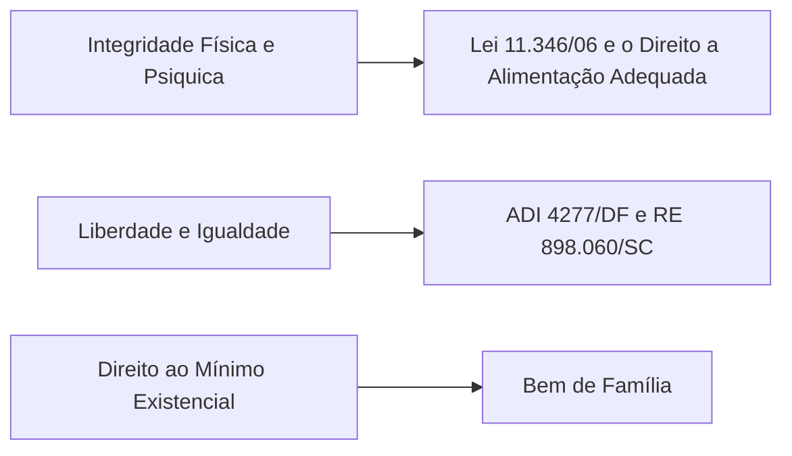

# Personalidade e Capacidade Jurídica

## Noções Conceituais

Toda pessoa tem personalidade jurídica, recebedora de uma proteção jurídica mínima essencial, os direitos da personalidade. Os direitos da personalidade são direitos subjetivos extrapatrimoniais que protegem a existência da pessoa. São uma construção recente, surgindo no pós-guerra.

Os Direitos da Personalidade são uma forma de expressão da dignidade humana nas relações privadas.

Embora não se possa conceituar com precisão o que significa a Dignidade Humana, pode-se elencar com segurança um **núcleo essencial** de seu conteúdo. Nesse sentindo o direito a integridade física e psiquica, a liberdade e igualdade e o direito ao mínimo existêncial.


Ter personalidade jurídica, conforme expresso no Código Civil, gera capacidade jurídica. No entanto, a mera capacidade **não** implica na personalidade jurídica, como no caso dos **Entes Despersonalizados** (e.g. Sociedade de Fato, Condomínio Edilício, Herança Jacente e Vacante).

### Direitos da Personaliade e Liberdades Públicas


Por vezes os Direitos da Personalidade implicam uma correlação entre seu conteúdo e as obrigações impostas ao Estado. Essa correlação pode ser exemplificada no uso de *Habeas Corpus* para garantir o direito de expressão no caso de uma manifestação em defesa do uso de drogas.


## Momento aquisitivo dos Direitos da Personalidade

<Callout type="warning">
Alta incidência em concursos
</Callout>

O momento aquisitivo da personalidade jurídica é o da concepção. No entanto, a construção teórica limita os direitos do nacituro somente aos direitos extrapatrimoniais. Assim, não possuem antes do nascimento os direitos patrimoniais.

Como os direitos da personalidade são reconhecidos desde a concepção, é consequência natural que o **natimorto** possua a mesma proteção jurídica que o nascido com vida. Veja o conteúdo do enuncaido da Jornadas:

```md filename="Jornadas de Direito Civil 1" copy
**Enunciado 1**: A proteção que o Código defere ao nascituro alcança o natimorto no que concerne aos direitos da personalidade, tais como nome, imagem e sepultura.
```


###
